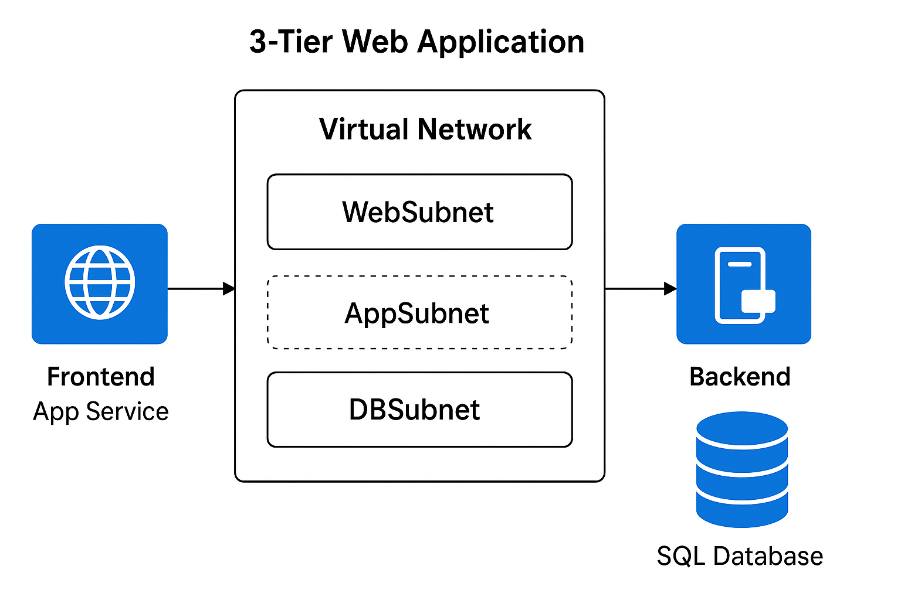

# Azure 3-Tier Web Application Deployment

**Project Overview**  
This project demonstrates deploying a multi-tier web application architecture in Azure, involving:  
- Frontend: Azure App Service  
- Backend: Virtual Machine (API layer)  
- Database: Azure SQL Database  
- Networking: Virtual Network (Web / App / DB subnets) with NSG-based segmentation  
- Limitations: Monitoring setup was restricted in sandbox

---

## Prerequisites  
- Azure subscription (or Whizlabs sandbox)  
- Azure CLI or access to Azure Portal  
- Basic understanding of subnets, NSGs, and Azure services

---

## Architecture  

---

## Steps Taken  

1. Created Resource Group  
2. Configured a Virtual Network with 3 subnets  
3. Deployed App Service (frontend)  
4. Deployed Virtual Machine (backend)  
5. Created Azure SQL Database (Basic tier)  
6. Configured network security via NSGs  
7. Attempted monitoring setup — restricted in sandbox  
8. Documented all steps with screenshots  

--- 

---

## Screenshots  

| Feature | Screenshot |
|--------|------------|
| Resource Group | `Screenshots/01_ResourceGroup.png` |
| VNet & Subnets | `Screenshots/02_VNet_Subnets.png` |
| App Service | `Screenshots/03_AppService.png` |
| VM | `Screenshots/04_VM.png` |
| SQL Database | `Screenshots/05_SQLDB.png` |
---

## Limitations & Future Improvements  
- Monitoring metrics could not be enabled due to sandbox restrictions  
- Could add Bicep / ARM templates for full automation  
- Use Private Endpoints for SQL in a production scenario  
- Enhance security with VNet integration for App Service, Managed Identity, Key Vault

---

## Skills Demonstrated  
- Azure resource deployment & management  
- Network configuration, segmentation & security  
- Infrastructure troubleshooting and working within policy constraints  
- Documentation & architecture communication

